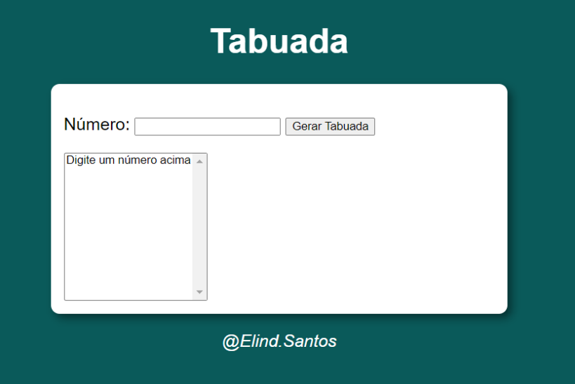
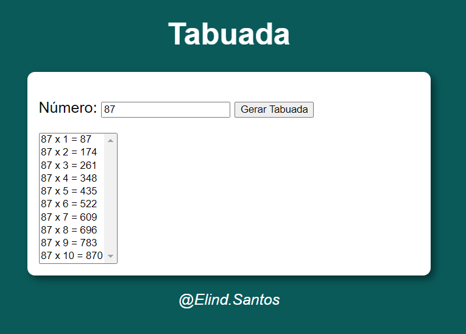

# Tabuada Simples
 Digite um número e o programa irá gerar a tabuada do 0 ao 10

 Essa tabuada é um projeto simples, no qual eu estou aprendendo HTML5, CSS e JavaScript, junto aos vídeos do canal do YouTube "Curso em vídeo" do Gustavo Guanabara. 🫡​✌️

 Exemplos a seguir: 

 Tabuada vazia sem valor:

Tabuada com o valor inserido de "87" e mostrando o resultando do 0 ao 10:

